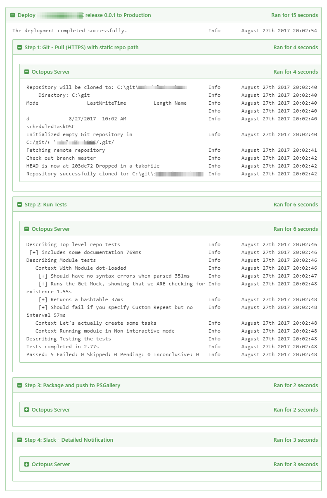

# Takofukku

## What?

たこ
**Tako: Octopus**

フック
**Fukku: Hook**

An Azure function that triggers [Octopus Deploy](https://octopus.com/) Projects from Github push event hooks. 

## What does it do?

When you push to github, it creates a release for you, adds the github head commit as release notes, then deploys the new release.

## Why?

Because there's currently no built-in webhook solution for Octopus Deploy, and users often roll their own, or use a build server to do the triggering. Not every project *needs* a build server though.

Inspired by [Domain's Ops Code pipeline](http://tech.domain.com.au/2015/06/deploy-on-merge-in-domains-devops-repositories/), but with simplified config, a more tweakable deployment engine and a new concept called a **takofile**.

Takofukku is especially strong at deploying code that doesn't pre-built artifacts, so supports scenarios such as

- Using Octopus Deploy as a ghetto build/CI server
- Automating PowerShell tests on multiple targets with Pester
- Ops deployment projects that do simple git pulls, rather than full builds
- Packaging workflows driven out of github
- Any project which doesn't use nuget packages
- Anything you want to use Octopus as a post-push task runner for - I have projects that do nothing but email me and send me a slack message.

Of course, Octopus being Octopus, you can do pretty much anything with a bit of script. I look forward to seeing what kind of weird solutions this inspires, and what sort of things one might want to run on a git push.

## OK, so... What's a **takofile**?

A takofile is not unlike `appveyor.yml` or `.travis.yml`. It's a little file that lives in the root of your github repo, and defines a branch-to-environment mapping, a repo-to-project mapping, and some other common config bits.

## OK, so how do I hook this up?

_Takofukku.io is in private beta right now. I'll be releasing it to the public at large very very soon. But if you want to be a guinea pig, feel free to hit me up. I am [@cloudyopspoet on Twitter](https://twitter.com/cloudyopspoet). For private beta users, the following will work *with the addition of a secret parameter*_

Go to settings in your github repository and set up a webhook integration that captures the push event. Point that to

`https://hook.takofukku.io/api/Takofukku?apikey=<your octopus api key>`

Then in the root of your repo, add a takofile as follows

```
---
Server: https://deploy.d.evops.co/
Project: Takofukku
Mappings:
  - 
    Branch: master
    Environment: Production
  - 
    Branch: release
    Environment: Staging
  - 
    Branch: develop
    Environment: UAT
CreateRelease: true
```

You can add as many mappings as you like. If you don't provide mappings, Takofukku will default to master->Production, everwhere else->Staging

## What about channels?

At present, Takofukku only supports Default as a channel. Full channel support is coming soon. It also might not work on older versions of OD. Yet.

## It always creates a new release. What gives?

That option is not implemented just yet. But it will be soon.

## My repos are private. Can I still use it?

Yes, you can.

`https://hook.takofukku.io/Takofukku?apikey=<your octopus api key>&accesstoken=<github personal access token>`

## About Tokens and API keys

Takofukku doesn't store your tokens or API keys. The source code is in this very repo, so you can check that for yourself. However, it's still worth dedicating a specific API key and token solely to Takofukku, to make key rotation easier. It's a good idea to rotate these keys periodically, and this process can be automated.

While we're talking security, Do use HTTPS for your Octopus server. Github to Takofukku is encrypted, but Takofukku to Octopus is under your control, in your takofile. Do use https. Octopus now [natively supports LetsEncrypt](https://octopus.com/docs/administration/lets-encrypt-integration), so please use it.

## Does this mean I can use Octopus Deploy as a CI server?

Yes, you kinda can. Octopus can run F#, PowerShell, C#Script and bash, so if those languages can run your builds and tests, then Octopus *can* run builds for you. It's not really what Octopus is designed for, but it can work. But definitely don't neglect running tests. If it's powerShell you're pushing out, I recommend [Pester](https://github.com/Pester/Pester), with an Octopus script step like this:

```
$result = Invoke-Pester -EnableExit
EXIT $result
```

Which will run your tests and abort if they fail. To use that, Have a deploy step that throws your code in a sandbox location, then the tests, then move the deployed code into its target location. Like this project, for instance:



Yes, it pulls your PowerShell code, Pesters it, then if it passes, pushes it to Production. Cheap PowerShell CI for the win (Yes, the example is lightweight, deliberately so)

A truly awesome version of this would use Octopus's Docker features to test in a disposable container before deploying. That would be very nice indeed. Feel free to try it and report back.

## Can I contribute?

In code, in money, or in beer. Yes.

## Can I fork this and run my own private Takofukku?

Sure. That's why it's open source. It runs on the Azure Functions platform, but shouldn't be too hard to adapt to other platforms. Please do contribute back in, though.

## I know you. You've been talking about this for ages. WHy did it take so long?

Shut up. I started writing it in Powershell, then decided C# would be better, remembered I don't really like C#, went back to PowerShell, got doubts about performance and scalability and then, eventually, threw it all away in favour of F#. Which is excellent.

Yes, I never finish anyth